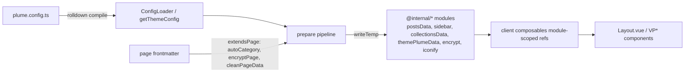

# Repository Guidelines

## Project Overview

VuePress 2 theme monorepo (`vuepress-theme-plume`): a blog/documentation theme, bundled plugins, a project scaffolder, the documentation site, and runnable examples. Published packages use `dist/` as build output.

> Note: `CLAUDE.md` claims build output goes to `lib/`. That is stale — every package emits to `dist/` (`theme/package.json` exports, tsdown configs, `.gitignore`).

## Architecture & Data Flow

### Packages

| Path                                          | Package                         | Role                                                            |
| --------------------------------------------- | ------------------------------- | --------------------------------------------------------------- |
| `theme/`                                      | `vuepress-theme-plume`          | Main theme: node build pipeline + client runtime                |
| `plugins/plugin-search/`                      | `@vuepress-plume/plugin-search` | Local full-text search (MiniSearch) index + UI                  |
| `plugins/plugin-md-power/`                    | `vuepress-plugin-md-power`      | MarkdownIt power features (containers, embeds, charts, REPL, …) |
| `plugins/plugin-fonts/`                       | `@vuepress-plume/plugin-fonts`  | Node-only font/icon assets                                      |
| `cli/`                                        | `create-vuepress-theme-plume`   | `npm create vuepress-theme-plume` scaffolder                    |
| `docs/`                                       | private `docs`                  | Docs site (dogfoods the theme + plugins)                        |
| `examples/pure-blog`, `examples/layout-slots` | private                         | Example sites; layout-slots demos ~80 theme slots               |

### Theme layers (`theme/src/`)

- **`node/`** — build-time. `theme.ts` exports `plumeTheme()`, which returns a VuePress `Theme` hook object (`alias`, `plugins`, `extendsPage`, `onInitialized`, `onPrepared`, `onPageUpdated`, `onWatched`, `extendsMarkdownOptions`, `extendsBundlerOptions`, `templateBuildRenderer`, `clientConfigFile`).
  - Config loading: `loadConfig/ConfigLoader.ts` compiles the user's `plume.config.{ts,js,…}` with rolldown, deep-merges defaults, and exposes a module singleton; **all node code reads options via `getThemeConfig()`**, never from raw hook args.
  - Preparation: `prepare/prepareData()` runs `prepareSidebar`, `preparedPostsData`, `prepareCollections`, `prepareEncrypt`, `prepareIcons`, `prepareArticleTagColors`, `prepareHomeHeroEffects` in parallel and writes virtual `@internal/*` modules consumed by the client.
  - Collections are the core content model (`ThemeCollections` in `shared/features/collection.ts`): `post` (blog lists, tags, archives, categories) and `doc` (sidebar docs). Legacy `blog`/`notes` config is auto-migrated by `collections/compat.ts`.
  - `autoFrontmatter/` generates/repairs frontmatter for files matching collection rules (title, `createTime`, permalink) and watches for new files.
- **`client/`** — browser runtime. `config.ts` (`defineClientConfig`) installs `setupThemeData`, `setupDarkMode`, `setupCollection`, `setupSidebar`, `setupHeaders`, `setupEncrypt`, `setupWatermark`; `Layout.vue` renders the full shell and exposes the theme's slot surface. Composables in `client/composables/` are the only way components consume state.
- **`shared/`** — **type-only** public surface: `options.ts` (`ThemeOptions`), `data.ts`, `pageData.ts`, `frontmatter/*`, `features/*` (collections, encrypt, search, posts, navbar, sidebar, markdown), `locale/`. No shared runtime values; node/client both import these types.

### Data flow



Search has no index in the theme: `components/Nav/VPNavBarSearch.vue` renders a global `SearchBox` supplied by `plugin-search` (local) or `@vuepress/plugin-docsearch` (algolia), selected in `node/plugins/setupPlugins.ts`.

## Key Directories

- `theme/src/node/` — `config/`, `loadConfig/`, `prepare/`, `collections/`, `pages/`, `autoFrontmatter/`, `plugins/`, `locales/`, `utils/`.
- `theme/src/client/` — `components/` (`VP*` PascalCase, subdirs `Home/`, `Posts/`, `Nav/`, `global/`, `background/`), `composables/`, `layouts/`, `features/`, `styles/`.
- `theme/src/shared/` — cross-layer types only.
- `plugins/*/src/{node,client,shared}` — same three-layer convention in each plugin.
- `cli/src/` + `cli/templates/` — prompts/generation; `.tpl` templates are Eta-rendered and copied into the new project.
- `docs/.vuepress/` — `config.ts`, `theme.ts`, `plume.config.ts`, `navbar.ts`, `client.ts`, `collections/{zh,en}/`.
- `scripts/` — `tsdown-args.ts` (per-target build flags), `strip-comments.ts` (post-build strip/format), `mirror-sync.mjs` (npmmirror sync, release only).
- `examples/<name>/docs/.vuepress/` — runnable configs consuming the theme via `workspace:*`.

## Development Commands

```bash
pnpm install                 # workspace install (pnpm only)

pnpm build                   # clean + build every package → dist/
pnpm dev                     # theme watch + docs dev server concurrently
pnpm dev:package             # theme + plugin-md-power watchers only

pnpm test                    # vitest, TZ=Etc/UTC, coverage on (watches on a TTY)
pnpm test --run              # single run
pnpm test theme/__test__/configLoader.spec.ts   # single file
pnpm test -t '<name>'        # name filter

pnpm lint                    # eslint . + stylelint **/*.{css,vue}
pnpm lint:fix

pnpm docs:dev                # waits for theme/dist/node/index.js, then vuepress dev
pnpm docs:build              # vuepress build + lunaria translation check
pnpm docs:serve
pnpm --filter pure-blog docs:dev      # examples (theme must be built)
pnpm release                 # release:check (lint+build) then bumpp version/tag/push
```

- Packages resolve at runtime from `dist/`; rebuild after editing `src/` (`pnpm build`, or `pnpm dev` for watch). Plugins except `plugin-md-power` have no dev script — a full `pnpm build` is required.
- Add dependencies through catalogs, not inline versions: declare in the correct catalog in `pnpm-workspace.yaml` (`dev`, `prod`, `peer`, `vuepress`) and reference `"catalog:<name>"` in the package manifest. `catalogMode: prefer`; VuePress deps are exact pins in the `vuepress` catalog.
- Markdown code fences are eslint-checked; `markdownlint` config exists but is not wired into scripts.

## Code Conventions & Common Patterns

- **ESM everywhere.** Relative imports must include the `.js` extension even from `.ts` sources (`import { LRUCache } from './lru.js'`). Use `import type { … }` blocks, then external, then relative imports.
- **Aliases:** `@theme/<Component>.vue` (node generates from every `client/components/**/*.vue` via `setupAlias.ts`), `@internal/<module>` (virtual modules, typed in `theme/src/client/shim.d.ts` — declare new ones there). Public package subpaths: `vuepress-theme-plume/client`, `/shared`, `/composables`, `/components/*`, `/features/*`.
- **Naming:** files camelCase in `node/` (`preparePostsData.ts`), kebab-case for composables (`sidebar-data.ts`); components `VP*` PascalCase; composables `useX`; node functions `prepareX`/`resolveX`/`detectX`/`setupX`/`generateX`; types `Theme*`/`Resolved*`; constants `UPPER_SNAKE`.
- **Error handling:** `logger` from `node/utils` (`logger.warn/error/info`) for build messages; fallible IO wrapped in `attemptAsync`/try-catch that logs and continues; user-config failures are recorded in `ConfigLoader` and surfaced by `configLoader.waiting()` so the build fails visibly. Option validation is warn-only unless the build cannot proceed.
- **Async:** async/await end-to-end; `Promise.all` for independent prepare steps; `p-map` for bounded concurrency; chokidar watchers registered from `onWatched`; module-level `Map`/`LRUCache` caches.
- **Dependency injection:** VuePress's theme hook object is the node-side DI surface; client-side use `createSymbol()` → `app.provide` in a `setupX()` installer → `useX()` that `inject()`s and throws `'useX() is called without provider.'` No pinia/vuex.
- **State management:** module-scoped `ref`/`computed` singletons in composables, hydrated from `@internal/*` modules; dev HMR hooks guarded by `if (__VUEPRESS_DEV__ && (import.meta.webpackHot || import.meta.hot))` and mirrored by node's `resolveContent`/`writeTemp` helpers.
- **Comments/docs:** exported symbols carry bilingual (English + Chinese) JSDoc; mark deprecations with `@deprecated` and keep migration paths (e.g. `blog`/`notes` → `collections`).
- **Formatting/lint:** eslint via `@pengzhanbo/eslint-config-vue` (a11y on for `.vue`, off for docs), stylelint via `@pengzhanbo/stylelint-config`; **no Prettier** (`prettier.enable: false`, editor formatOnSave off). Formatting is handled by `scripts/strip-comments.ts` (oxfmt) during build — do not reformat unrelated code.
- **Commits:** Conventional Commits enforced by commitlint; allowed scopes: `docs`, `theme`, `cli`, `plugin-search`, `plugin-md-power`, `plugin-fonts`. Changelog uses the angular preset.
- **TypeScript:** strict preset from `tsconfig-vuepress/base.json` via root `tsconfig.base.json` (target ES2023, `moduleResolution: Bundler`, `noImplicitAny: false`); one root tsconfig covers all packages — there are no per-package tsconfigs. dts is emitted by tsdown.

## Important Files

- `theme/src/node/theme.ts` — `plumeTheme()` and the VuePress hook wiring.
- `theme/src/node/loadConfig/ConfigLoader.ts`, `compiler.ts` — config discovery/compile/reload; `getThemeConfig()` singleton.
- `theme/src/node/prepare/prepareThemeData.ts`, `preparePostsData.ts`, `prepareSidebar.ts`, `prepareCollections.ts` — build-time data generation.
- `theme/src/client/config.ts`, `layouts/Layout.vue`, `composables/data.ts`, `composables/theme-data.ts` — client entry, shell, composable root.
- `theme/src/shared/options.ts`, `shared/features/collection.ts`, `shared/frontmatter/*` — public config/content types.
- `theme/tsdown.config.ts`, `plugins/*/tsdown.config.ts`, `cli/tsdown.config.ts` — build units and externals; `scripts/tsdown-args.ts` toggles client/node/watch (`-- -c` = client only).
- `vitest.config.ts`, `eslint.config.js`, `stylelint.config.js`, `commitlint.config.js`, `tsconfig.base.json`, `pnpm-workspace.yaml` — toolchain source of truth.
- `docs/.vuepress/{config.ts,theme.ts,plume.config.ts,collections/zh/*}` — how the theme is configured and how docs pages are registered into navigation.
- `cli/src/{index.ts,run.ts,prompt.ts,generate.ts}`, `cli/templates/**` — scaffolder flow and generated project shape.

## Runtime/Tooling Preferences

- **Node** `^20.19.0 || >=22.12.0` (CI uses Node 24); **pnpm** `>=12.6.0` (`packageManager: pnpm@12.7.0`) — never npm/yarn for install; workspace deps use `workspace:*`.
- **Build:** tsdown with `--config-loader unrun`; static assets (`.vue`, `.css`, `.scss`, images, fonts, `.d.ts`) are copied by `cpx`, not bundled. Node targets node20.19; client bundles are browser ESM and externalize `*.vue`, `*.css`, `@internal`, `@theme`, and internal shared barrels.
- **Docs/examples** use `@vuepress/bundler-vite` + VuePress `2.0.0-rc.31` (exact pins in the `vuepress` catalog).
- Many theme features rely on optional peers (`three`, `swiper`, `gsap`, `p5`-adjacent effect deps, `pinyin-pro`, `@iconify/json`, mathjax…) — never make them hard dependencies; detect with `isPackageExists` and warn.
- CI (`.github/workflows/{lint,test,docs-deploy,example-layout-slots-deploy,release}.yaml`) runs `pnpm install --frozen-lockfile`, Node 24; release is tag-driven (`v*`) and runs `pnpm build` → `release:publish` → `release:sync`.

## Testing & QA

- **Framework:** Vitest 5 with `@vitest/coverage-v8`; single root config `vitest.config.ts`, node environment, no setup files, no globals (always `import { describe, expect, it } from 'vitest'`).
- **Layout:** `<package>/__test__/<topic>.spec.ts` at package roots (never inside `src/`): `theme/__test__/`, `cli/__test__/`, `plugins/plugin-search/__test__/`, `plugins/plugin-md-power/__test__/` (majority of specs). No shared test utils; fakes (`createFakeApp`, `createMarkdown`) and fixtures are declared per spec.
- **Conventions:** import sources via relative ESM paths with `.js`; mock with `vi.mock` (e.g. `memfs` for `node:fs`, `nano-spawn`, VuePress modules); real-FS fixtures go under `<spec dir>/.tmp/` (gitignored) and are cleaned in `afterEach/afterAll`; platform-dependent tests use `it.skipIf`/`ctx.skip()`; snapshots only for `plugin-md-power` markdown output (`__snapshots__/`).
- **Coverage:** enabled by default (v8, `text`/`clover`/`json`), **no thresholds**; test files and `dist`/`lib`/`demo` excluded. Cover behavior, boundaries, and error paths rather than snapshotted incidental output.
- **Commands:** see Development Commands. Always run tests with the repo's TZ pin (`pnpm test` does this; direct vitest runs need `cross-env TZ=Etc/UTC`). Pre-commit runs `vitest related --run` for staged js/ts changes, so tests touching changed modules run automatically.
