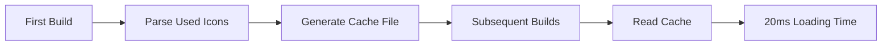

## Image Dimension Optimization&#x20;

When embedding images in Markdown documents via `` or ``,
the content displays correctly, but potential layout stability issues are often overlooked.

### Layout Shift Analysis

Layout shifts are not obvious when images are small or network conditions are good.
However, with large images or poor network conditions, layout reflow during image loading becomes prominent:

1. **Before Loading**: Image placeholder space is not reserved, subsequent content is pushed up
2. **After Loading**: Image suddenly occupies space, forcing subsequent content to reflow
3. **User Experience**: Frequent layout changes cause visual jumps and operation lag

### Solution: Pre-calculate Image Dimensions

According to [MDN documentation](https://developer.mozilla.org/en-US/docs/Web/HTML/Element/img#height),
specifying both `height` and `width` attributes allows browsers to calculate the image aspect
ratio in advance and reserve display space, eliminating layout shifts at the source.

Automated solution provided by the theme:

```ts
export default defineUserConfig({
  theme: plumeTheme({
    plugins: {
      markdownPower: {
        imageSize: true, // Optional 'local' | 'all'
      },
    }
  })
})
```

**Configuration Options**:

* `'local'` or `true`: Only add dimension attributes for local images
* `'all'`: Process both local and remote image resources

**Implementation Mechanism**:

* Automatically analyze original image dimensions during build
* Inject precise `width` and `height` attributes into `` tags
* Reserve display space based on image aspect ratio

::: important Performance Considerations

* This feature only takes effect in **production builds** to avoid performance overhead during development
* Using the `'all'` option requests all remote image resources, which may significantly increase build time
* Optimization strategy: Concurrent requests + header information analysis, terminating connections immediately after obtaining dimension data
  :::

## Icon Loading Optimization

### Iconify Integration Benefits

The theme deeply integrates with the [Iconify](https://icon-sets.iconify.design/) project,
providing access to over 200,000 icons with flexible selection. Although locally installing the
`@iconify/json` package requires approximately 70MB of storage,
only the actually used icon resources are included in the build, achieving on-demand loading.

### Performance Bottlenecks and Solutions

**Root Cause**:
Icons are organized by collections, with each collection containing JSON files of 100-1000+ icons.
When using icons from multiple different collections, frequent I/O reads and JSON parsing create significant performance overhead.

**Real-world Case**:

* Using 160+ icons from 54 icon collections
* Initial build: ~500ms icon parsing time
* User experience: Slow development server startup

**Cache Optimization Mechanism**:



**Optimization Results**:

* Build time reduced from 500ms to 20ms
* Development server startup speed significantly improved
* Maximum resource utilization

### Best Practice Recommendations

1. **Icon Usage Planning**:
   * Prioritize icons from the same collection
   * Avoid overly dispersed usage across different collections

2. **Development Experience Optimization**:
   * Cache automatically takes effect after first startup
   * Intelligent cache updates when adding new icons
   * No manual cache management required

3. **Production Build Assurance**:
   * Cache mechanism doesn't affect final output
   * Maintains on-demand loading characteristics of icon resources
   * Ensures optimal build artifact size

Through these two optimization measures, the theme maintains rich functionality while ensuring excellent build performance and runtime experience.
