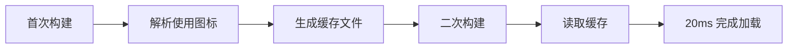

## 图片尺寸优化&#x20;

在 Markdown 文档中通过 `` 或 `` 嵌入图片时，虽然能够正常显示内容，但潜在的布局稳定性问题往往被忽视。

### 布局抖动问题分析

当图片体积较小或网络状况良好时，页面布局抖动并不明显。然而，面对大体积图片或较差的网络环境，图片加载过程中的布局重排问题就会凸显：

1. **加载前**：图片占位空间未被预留，后续内容向上挤压
2. **加载后**：图片突然占据空间，迫使后续内容重新排列
3. **用户体验**：频繁的布局变化导致视觉跳动和操作卡顿

### 解决方案：预计算图片尺寸

根据 [MDN 文档](https://developer.mozilla.org/zh-CN/docs/Web/HTML/Element/img#height)的建议，同时指定 `height` 和 `width` 属性能够让浏览器提前计算图片宽高比，预留显示空间，从根本上消除布局偏移。

主题提供的自动化解决方案：

```ts
export default defineUserConfig({
  theme: plumeTheme({
    plugins: {
      markdownPower: {
        imageSize: true, // 可选 'local' | 'all'
      },
    }
  })
})
```

**配置选项说明**：

* `'local'` 或 `true`：仅为本地图片添加尺寸属性
* `'all'`：同时处理本地和远程图片资源

**实现机制**：

* 构建时自动分析图片原始尺寸
* 为 `` 标签注入精确的 `width` 和 `height` 属性
* 基于图片宽高比预留显示空间

::: important 性能注意事项

* 此功能仅在**生产环境构建**时生效，避免开发阶段性能损耗
* 使用 `'all'` 选项时会请求所有远程图片资源，可能显著增加构建时间
* 优化策略：并发请求 + 头部信息分析，在获取尺寸数据后立即终止连接
  :::

## 图标加载优化

### Iconify 集成优势

主题深度集成 [Iconify](https://icon-sets.iconify.design/) 项目，提供超过 20 万枚图标的选择灵活性。虽然本地安装 `@iconify/json` 包需要约 70MB 存储空间，但实际构建时仅包含使用到的图标资源，实现按需加载。

### 性能瓶颈与解决方案

**问题根源**：
图标按集合（collection）组织，每个集合包含 100-1000+ 个图标的 JSON 文件。当使用多个不同集合的图标时，频繁的 I/O 读取和 JSON 解析会产生显著性能开销。

**实际案例**：

* 使用 54 个图标集合中的 160+ 个图标
* 初始构建：约 500ms 图标解析时间
* 用户体验：开发服务器启动缓慢

**缓存优化机制**：



**优化效果**：

* 构建时间从 500ms 降至 20ms
* 开发服务器启动速度显著提升
* 资源利用率最大化

### 最佳实践建议

1. **图标使用规划**：
   * 优先选择同一集合内的图标
   * 避免过度分散使用不同集合

2. **开发体验优化**：
   * 首次启动后缓存自动生效
   * 新增图标时缓存智能更新
   * 无需手动干预缓存管理

3. **生产构建保障**：
   * 缓存机制不影响最终输出
   * 保持图标资源的按需加载特性
   * 确保构建产物的最优体积

通过这两项优化措施，主题在保持功能丰富性的同时，确保了优秀的构建性能和运行时体验。
