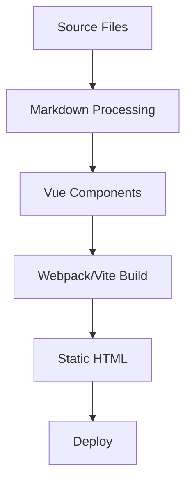

# VuePress Plume Skills

This directory contains specialized skills for VuePress Plume theme, designed to enhance your development experience with AI agents.

## 1. Skill Introduction

The `skills` directory currently provides the following skills:

### 🌟 Available Skills

| Skill Name | Description | Key Features |
| ---------- | ----------- | ------------ |
| **vuepress-plume-config** | Theme Configuration Generator | • Generates `config.ts`, `plume.config.ts`<br>• Manages `collections`, `navbar`, `sidebar`, `locales`<br>• Supports `plugins`, `markdown`, `codeHighlighter`<br>• Configures `encrypt`, `bulletin`, `copyright`, `llmstxt`<br>• Supports `search`, `comment`, `watermark` |
| **vuepress-plume-markdown** | Markdown Writing Assistant | • Provides syntax for Plume's Markdown extensions<br>• Supports Containers (hint, alert, details, etc.)<br>• Supports Charts (Mermaid, ECharts, Chart.js, etc.)<br>• Supports Embeds (YouTube, Bilibili, PDF, CodePen, etc.)<br>• Code block features (highlight, focus, diff, etc.)<br>• LLMs txt markup (`<llm-only>`, `<llm-exclude>`) |

### 🔍 Selection Guide

- **Use `vuepress-plume-config` when:**
  - You are initializing a new VuePress Plume project.
  - You need to update the theme configuration, navbar, sidebar, or collections.
  - You want to configure complex settings like locales, plugins, or markdown extensions.
  - You need to set up encryption, comments, search, or other advanced features.
  - You want to enable LLMs txt generation for AI assistant integration.

- **Use `vuepress-plume-markdown` when:**
  - You are writing content in Markdown files.
  - You want to use advanced features like containers, code groups, tabs, or diagrams.
  - You need to embed media (videos, PDFs) or external content (CodePen, CodeSandbox).
  - You want to add code block features like line highlighting, diff, or focus.
  - You need to create charts (Mermaid, ECharts) or mind maps (Markmap).

---

## 2. Installation and Configuration

You can install these skills into your project or globally using the `skills` CLI tool.

### Prerequisites

- Node.js installed
- `npx` available

### Installation Steps

1. **Install skills from this repository:**

    ```bash
    # Install into your current project (recommended for teams)
    npx skills add https://github.com/pengzhanbo/vuepress-plume

    # Install specific skill only
    npx skills add https://github.com/pengzhanbo/vuepress-plume --skill vuepress-plume-config
    ```

2. **Verify Installation:**

    ```bash
    npx skills list
    ```

    You should see the installed skills listed in the output.

---

## 3. Integration Guide

### 🤖 Claude Code Integration

Claude Code automatically detects skills in the `.claude/skills` directory or the standard `skills` directory if configured.

**Setup:**

```bash
# Install for Claude Code specifically
npx skills add https://github.com/pengzhanbo/vuepress-plume -a claude-code
```

**Configuration:**
Ensure your `~/.claude/config.json` or project configuration allows loading skills from the installed location.

### 🌐 OpenCode Integration

OpenCode supports the open agent skills standard.

**Setup:**

```bash
# Install for OpenCode
npx skills add https://github.com/pengzhanbo/vuepress-plume -a opencode
```

**Usage:**
Once installed, OpenCode agents will automatically index the skills and can be invoked using natural language prompts.

### 🚀 Trae Integration

Trae is a powerful IDE that can utilize these skills to assist you better.

**Setup:**

1. **Project-level:** Clone or install the skills into your project's `skills/` directory. Trae can scan and utilize `SKILL.md` files located in the project workspace.
2. **Usage:** Simply ask Trae to perform tasks related to the skills.

**Example:**
> "Help me configure the navbar for my VuePress site using the plume config skill."

**Debugging:**
If Trae doesn't recognize the skill, ensure the `SKILL.md` file is valid and contains the correct frontmatter (name, description).

---

## 4. Usage Examples

### 🛠️ Using `vuepress-plume-config`

#### Example 1: Initialize a Blog Configuration

**Prompt:**
> "Generate a `config.ts` for my VuePress Plume site with a blog setup, English and Chinese locales, and the filesystem cache enabled."

**Outcome:**
The agent will use the skill to create a `.vuepress/config.ts` file with the requested configuration structure.

#### Example 2: Configure Collections

**Prompt:**
> "Add a post collection for my blog at `blog/` directory with tags, categories, and archives enabled."

**Outcome:**
The agent will generate the appropriate `collections` configuration.

#### Example 3: Enable Encryption

**Prompt:**
> "Configure partial encryption for all pages under `/secret/` directory with password 'mypassword'."

**Outcome:**
The agent will add the `encrypt` configuration with the specified rules.

#### Example 4: Setup Comments with Giscus

**Prompt:**
> "Configure Giscus comments for my VuePress Plume site with repo 'user/repo' and category 'Announcements'."

**Outcome:**
The agent will add the `comment` configuration with Giscus provider settings.

### 📝 Using `vuepress-plume-markdown`

#### Example 1: Add a Timeline

**Prompt:**
> "I want to add a timeline of VuePress release history to my markdown file using the Plume timeline extension."

**Outcome:**
The agent will reference the `vuepress-plume-markdown` skill to provide the correct syntax:

```markdown
::: timeline
- Node 1
  time=2025-03-20 type=success

  Content

- Node 2
  time=2025-02-21 type=warning

  Content

- Node 3
  time=2025-01-22 type=danger

  Content
:::
```

#### Example 2: Code Block with Features

**Prompt:**
> "Show me how to create a code block with line numbers, title, and highlighted lines 2-4."

**Outcome:**
The agent will provide the syntax:

````markdown
```ts title="example.ts":line-numbers {2-4}
const line1 = 'normal'
const line2 = 'highlighted'
const line3 = 'highlighted'
const line4 = 'highlighted'
const line5 = 'normal'
```
````

#### Example 3: Embed a Bilibili Video

**Prompt:**
> "How do I embed a Bilibili video with BV ID 'BV1xx411c7mD' in my markdown?"

**Outcome:**
The agent will provide the embed syntax:

```markdown
@[bilibili](BV1xx411c7mD)
```

#### Example 4: Create a Mermaid Diagram

**Prompt:**
> "Create a flowchart using Mermaid showing the build process of VuePress."

**Outcome:**
The agent will provide:

````markdown

````

#### Example 5: Use LLMs txt Markup

**Prompt:**
> "How can I add content that's only visible in LLM-generated files?"

**Outcome:**
The agent will provide:

```markdown
<llm-only>

## Additional Context for AI

This section only appears in the LLM-friendly version of the documentation.

</llm-only>
```

---

## 5. Best Practices

### Recommendations

- **Version Control:** Commit your `skills/` directory to Git if you are using project-level skills. This ensures all team members have access to the same capabilities.
- **Updates:** Regularly check for updates to the skills to get the latest features and fixes.

    ```bash
    npx skills update
    ```

- **Feature Enablement:** Most markdown extensions need to be enabled in `.vuepress/config.ts`. Ensure you have the required features enabled before using them.

### Performance & Security

- **Review Changes:** Always review the configuration files generated by the `vuepress-plume-config` skill before deploying.
- **Safe Execution:** These skills primarily generate text/code. They do not execute system commands directly without user confirmation in most agent environments.
- **Encryption:** When using the `encrypt` feature, ensure your site is served over HTTPS for partial content encryption to work properly.
- **Cache Management:** When enabling cache, remember to remove `--clean-cache` from your dev script to benefit from caching.

---

## 6. Resources

### Documentation Links

- [Theme Configuration](https://theme-plume.vuejs.press/config/theme/)
- [Collections Configuration](https://theme-plume.vuejs.press/config/collections/)
- [Markdown Extensions](https://theme-plume.vuejs.press/guide/markdown/extensions/)
- [Code Features](https://theme-plume.vuejs.press/guide/code/features/)
- [Plugins](https://theme-plume.vuejs.press/config/plugins/)

### Related Projects

- [VuePress](https://v2.vuepress.vuejs.org/)
- [VuePress Theme Plume](https://github.com/pengzhanbo/vuepress-theme-plume)
