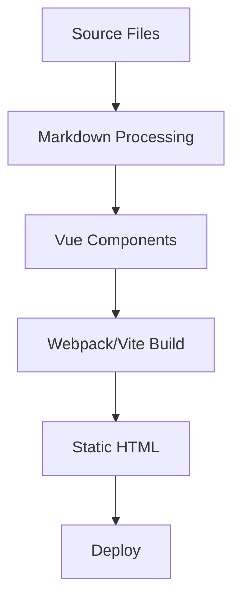

# VuePress Plume Skills

此目录包含为 VuePress Plume 主题定制的专用技能（Skills），旨在通过 AI 代理提升您的开发体验。

## 1. 技能介绍

`skills` 目录目前提供以下技能：

### 🌟 可用技能

| 技能名称 | 描述 | 主要特性 |
| ---------- | ----------- | ------------ |
| **vuepress-plume-config** | 主题配置生成器 | • 生成 `config.ts`、`plume.config.ts`<br>• 管理 `collections`、`navbar`、`sidebar`、`locales`<br>• 支持 `plugins`、`markdown`、`codeHighlighter`<br>• 配置 `encrypt`、`bulletin`、`copyright`、`llmstxt`<br>• 支持 `search`、`comment`、`watermark` |
| **vuepress-plume-markdown** | Markdown 写作助手 | • 提供 Plume Markdown 扩展语法<br>• 支持容器（hint、alert、details 等）<br>• 支持图表（Mermaid、ECharts、Chart.js 等）<br>• 支持嵌入（YouTube、Bilibili、PDF、CodePen 等）<br>• 代码块特性（highlight、focus、diff 等）<br>• LLMs txt 标记（`<llm-only>`、`<llm-exclude>`） |

### 🔍 选择指南

- **使用 `vuepress-plume-config` 的场景：**
  - 初始化一个新的 VuePress Plume 项目。
  - 需要更新主题配置、导航栏、侧边栏或集合。
  - 需要配置复杂设置，如多语言、插件或 Markdown 扩展。
  - 需要设置加密、评论、搜索或其他高级功能。
  - 想要启用 LLMs txt 生成以集成 AI 助手。

- **使用 `vuepress-plume-markdown` 的场景：**
  - 编写 Markdown 内容文件。
  - 需要使用高级功能，如容器、代码组、标签页或图表。
  - 需要嵌入媒体（视频、PDF）或外部内容（CodePen、CodeSandbox）。
  - 想要添加代码块特性，如行高亮、diff 或焦点。
  - 需要创建图表（Mermaid、ECharts）或思维导图（Markmap）。

---

## 2. 安装与配置

您可以使用 `skills` CLI 工具将这些技能安装到您的项目中或全局安装。

### 前置要求

- 已安装 Node.js
- `npx` 可用

### 安装步骤

1. **从本仓库安装技能：**

    ```bash
    # 安装到当前项目（团队协作推荐）
    npx skills add https://github.com/pengzhanbo/vuepress-theme-plume

    # 仅安装特定技能
    npx skills add https://github.com/pengzhanbo/vuepress-theme-plume --skill vuepress-plume-config
    ```

2. **验证安装：**

    ```bash
    npx skills list
    ```

    您应该能看到已安装的技能列在输出中。

---

## 3. 集成指南

### 🤖 Claude Code 集成

Claude Code 会自动检测 `.claude/skills` 目录或配置的标准 `skills` 目录中的技能。

**设置：**

```bash
# 专为 Claude Code 安装
npx skills add https://github.com/pengzhanbo/vuepress-theme-plume -a claude-code
```

**配置：**
确保您的 `~/.claude/config.json` 或项目配置允许从安装位置加载技能。

### 🌐 OpenCode 集成

OpenCode 支持开放代理技能（open agent skills）标准。

**设置：**

```bash
# 为 OpenCode 安装
npx skills add https://github.com/pengzhanbo/vuepress-theme-plume -a opencode
```

**使用：**
安装后，OpenCode 代理将自动索引技能，并可通过自然语言提示调用。

### 🚀 Trae 集成

Trae 是一个强大的 IDE，可以利用这些技能更好地协助您。

**设置：**

1. **项目级：** 克隆或安装技能到您项目的 `skills/` 目录。Trae 可以扫描并利用项目工作区中的 `SKILL.md` 文件。
2. **使用：** 直接要求 Trae 执行与技能相关的任务。

**示例：**
> "帮我使用 plume config skill 配置 VuePress 站点的导航栏。"

**调试：**
如果 Trae 无法识别技能，请确保 `SKILL.md` 文件有效且包含正确的 frontmatter（name, description）。

---

## 4. 使用示例

### 🛠️ 使用 `vuepress-plume-config`

#### 示例 1：初始化博客配置

**提示词：**
> "Generate a `config.ts` for my VuePress Plume site with a blog setup, English and Chinese locales, and the filesystem cache enabled."
> （"为我的 VuePress Plume 站点生成一个 `config.ts`，包含博客设置、中英文多语言支持，并启用文件系统缓存。"）

**结果：**
代理将使用技能创建一个包含请求配置结构的 `.vuepress/config.ts` 文件。

#### 示例 2：配置集合

**提示词：**
> "Add a post collection for my blog at `blog/` directory with tags, categories, and archives enabled."
> （"为我的博客添加一个 post 集合，目录为 `blog/`，并启用标签、分类和归档功能。"）

**结果：**
代理将生成相应的 `collections` 配置。

#### 示例 3：启用加密

**提示词：**
> "Configure partial encryption for all pages under `/secret/` directory with password 'mypassword'."
> （"为 `/secret/` 目录下的所有页面配置部分加密，密码为 'mypassword'。"）

**结果：**
代理将添加包含指定规则的 `encrypt` 配置。

#### 示例 4：配置 Giscus 评论

**提示词：**
> "Configure Giscus comments for my VuePress Plume site with repo 'user/repo' and category 'Announcements'."
> （"为我的 VuePress Plume 站点配置 Giscus 评论，仓库为 'user/repo'，分类为 'Announcements'。"）

**结果：**
代理将添加包含 Giscus 提供者设置的 `comment` 配置。

### 📝 使用 `vuepress-plume-markdown`

#### 示例 1：添加时间轴

**提示词：**
> "I want to add a timeline of VuePress release history to my markdown file using the Plume timeline extension."
> （"我想使用 Plume 时间轴扩展在 Markdown 文件中添加 VuePress 发布历史的时间轴。"）

**结果：**
代理将引用 `vuepress-plume-markdown` 技能提供正确的语法：

```markdown
::: timeline
- 节点一
  time=2025-03-20 type=success

  正文内容

- 节点二
  time=2025-02-21 type=warning

  正文内容

- 节点三
  time=2025-01-22 type=danger

  正文内容
:::
```

#### 示例 2：带特性的代码块

**提示词：**
> "Show me how to create a code block with line numbers, title, and highlighted lines 2-4."
> （"展示如何创建一个带行号、标题和高亮第 2-4 行的代码块。"）

**结果：**
代理将提供语法：

````markdown
```ts title="example.ts":line-numbers {2-4}
const line1 = 'normal'
const line2 = 'highlighted'
const line3 = 'highlighted'
const line4 = 'highlighted'
const line5 = 'normal'
```
````

#### 示例 3：嵌入 Bilibili 视频

**提示词：**
> "How do I embed a Bilibili video with BV ID 'BV1xx411c7mD' in my markdown?"
> （"如何在 Markdown 中嵌入 BV ID 为 'BV1xx411c7mD' 的 Bilibili 视频？"）

**结果：**
代理将提供嵌入语法：

```markdown
@[bilibili](BV1xx411c7mD)
```

#### 示例 4：创建 Mermaid 图表

**提示词：**
> "Create a flowchart using Mermaid showing the build process of VuePress."
> （"使用 Mermaid 创建一个展示 VuePress 构建流程的流程图。"）

**结果：**
代理将提供：

````markdown

````

#### 示例 5：使用 LLMs txt 标记

**提示词：**
> "How can I add content that's only visible in LLM-generated files?"
> （"如何添加仅在 LLM 生成文件中可见的内容？"）

**结果：**
代理将提供：

```markdown
<llm-only>

## Additional Context for AI

This section only appears in the LLM-friendly version of the documentation.

</llm-only>
```

---

## 5. 最佳实践

### 建议

- **版本控制：** 如果使用项目级技能，请将 `skills/` 目录提交到 Git。这确保所有团队成员都能使用相同的功能。
- **更新：** 定期检查技能更新以获取最新功能和修复。

    ```bash
    npx skills update
    ```

- **功能启用：** 大多数 Markdown 扩展需要在 `.vuepress/config.ts` 中启用。在使用前请确保已启用所需功能。

### 性能与安全

- **审查更改：** 在部署之前，始终审查由 `vuepress-plume-config` 技能生成的配置文件。
- **安全执行：** 这些技能主要生成文本/代码。在大多数代理环境中，未经用户确认，它们不会直接执行系统命令。
- **加密：** 使用 `encrypt` 功能时，请确保您的站点通过 HTTPS 提供服务，以便部分内容加密正常工作。
- **缓存管理：** 启用缓存时，请记得从开发脚本中移除 `--clean-cache` 以便从缓存中受益。

---

## 6. 资源

### 文档链接

- [主题配置](https://theme-plume.vuejs.press/config/theme/)
- [集合配置](https://theme-plume.vuejs.press/config/collections/)
- [Markdown 扩展](https://theme-plume.vuejs.press/guide/markdown/extensions/)
- [代码特性](https://theme-plume.vuejs.press/guide/code/features/)
- [插件](https://theme-plume.vuejs.press/config/plugins/)

### 相关项目

- [VuePress](https://v2.vuepress.vuejs.org/)
- [VuePress Theme Plume](https://github.com/pengzhanbo/vuepress-theme-plume)
