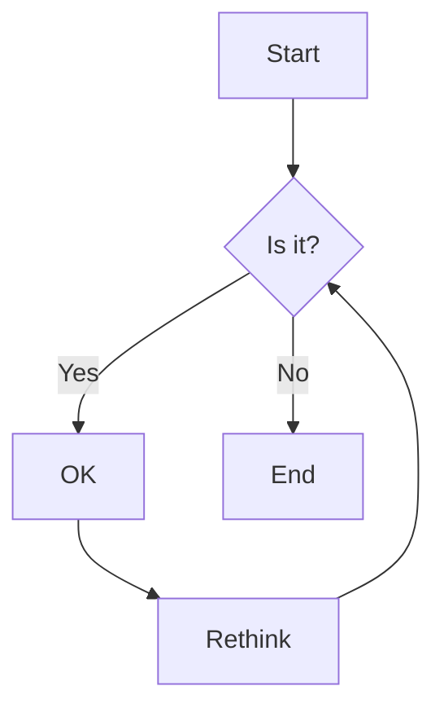

# Mermaid

The theme supports embedding diagrams generated by [Mermaid](https://mermaid.js.org/) within articles.

## Configuration

Enable the feature in `.vuepress/config.ts`:

```ts title=".vuepress/config.ts"
export default defineUserConfig({
  theme: plumeTheme({
    markdown: {
      mermaid: true,
    },
  })
})
```

You also need to install the `mermaid` library:

```sh
npm install mermaid
```

## Syntax

Use the `mermaid` code block or specific diagram type code blocks (e.g., `sequence`, `class`, `flow`, etc.).

````md

````

### Supported Diagram Types

You can use these aliases directly:

- `class` -> `classDiagram`
- `c4c` -> `C4Context`
- `er` -> `erDiagram`
- `gantt` -> `gantt`
- `git-graph` -> `gitGraph`
- `journey` -> `journey`
- `mindmap` -> `mindmap`
- `pie` -> `pie`
- `quadrant` -> `quadrantChart`
- `requirement` -> `requirementDiagram`
- `sankey` -> `sankey-beta`
- `sequence` -> `sequenceDiagram`
- `state` -> `stateDiagram-v2`
- `timeline` -> `timeline`
- `xy` -> `xychart-beta`

Example with title:

````md
```sequence Diagram Title
Alice->>John: Hello John, how are you?
John-->>Alice: Great!
Alice-)John: See you later!
```
````
